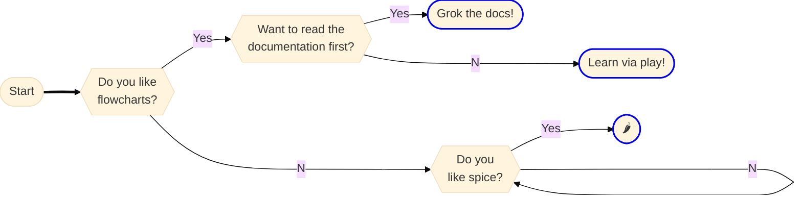

<h2 align="center">Spice up your profile README with a flowchart</h2>

```mermaid
%%{init:{
    "theme": "base",
    "flowchart": {
        "diagramPadding": "0",
        "nodeSpacing": "50",
        "rankSpacing": "50"
    }
}}%%

flowchart LR
    classDef clickStyle stroke:#0000EE,stroke-width:2px    
    A([Start]) ==>B{{Do you like<br> flowcharts?}}
    B --Yes--> C{{Want to read the<br> documentation first?}}
    C --Yes--> D([Grok the docs!])
    C --No--> E([Learn via play!])
    B --No--> B1{{Do you<br> like spice?}}
    B1 --Yes--> B2(["🌶️"])
    B1 --No--> B1    
    click B2 "https://youtu.be/dQw4w9WgXcQ" _blank
    click D "https://mermaid-js.github.io/mermaid/#/flowchart" _blank
    click E "https://mermaid.live/" _blank
    class B2,D,E clickStyle
```
